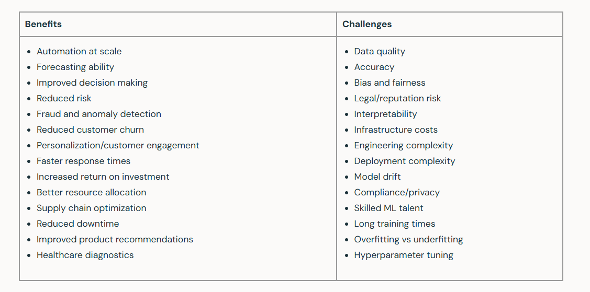
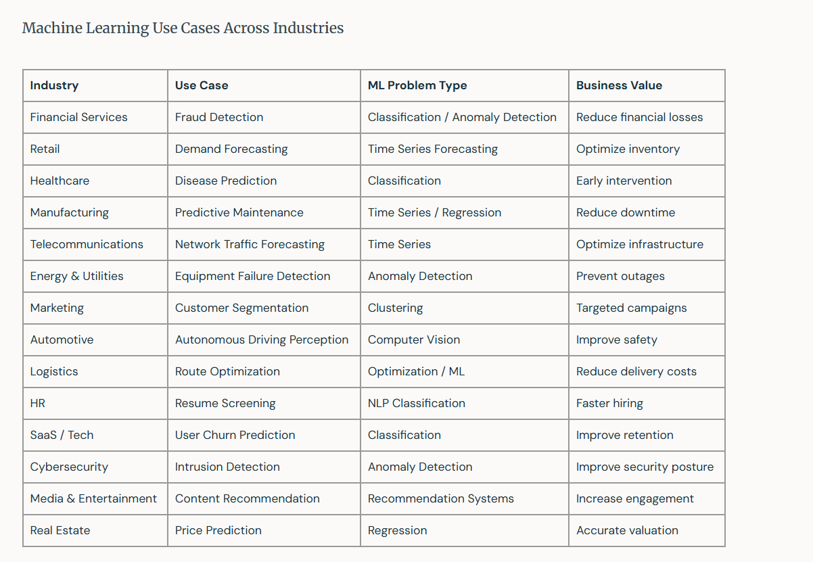

warm up
file:///C:/Users/user/Downloads/topic-01-classroom-app.html

Classify the ML types
https://miro.com/app/board/uXjVHw8Dl2Y=/ 

The anatomy of dataset 
file:///C:/Users/user/Downloads/ml-vocabulary-explorer.html

Excalidraw

https://excalidraw.com/  

case study
https://miro.com/app/board/uXjVHw8Dl2Y=/?moveToWidget=3458764681261683069

file:///C:/Users/user/Downloads/marketnest-framing-simulator.html  

Resources:
https://www.databricks.com/blog/machine-learning

# Beginning of the lesson:
https://www.mentimeter.com/app/presentation/alhi631q8r18g5h845apm9npgn64cgke/edit?rollout-assigned=1&question=vg98ic1w7ef5 

# N 1
Checking the understanding:

file:///C:/Users/user/Downloads/ml_activities%20(1).html - every student do these tasks seperately and share their results with screentshot to the chat

# N 2
Classify the ML types
https://miro.com/app/board/uXjVHw8Dl2Y=/  
students are divide to three groups and do the tasks in ecalidraw 
excalidraw they do: https://excalidraw.com/#json=MJzovsIjNHNpSNjo4CtW4,sN9sT1IgKWf3adYoa8iFLA  

I will explain it :
The anatomy of dataset 
file:///C:/Users/user/Downloads/ml-vocabulary-explorer.html 